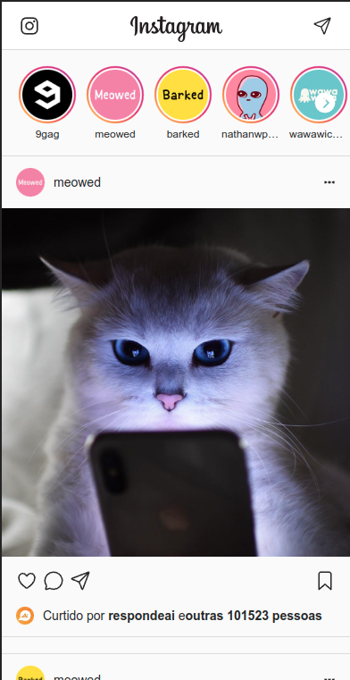
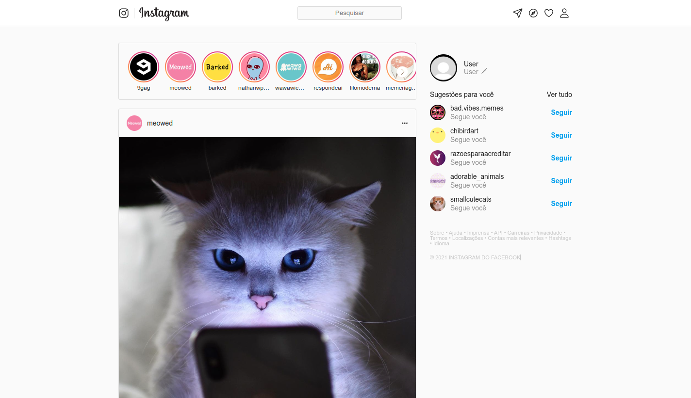

# Instagram [React]
O objetivo deste projeto é aprender os fundamentos do React criando um layout estático. Para isso, foram utilizados conceitos básicos do React.O projeto consiste em criar uma página estática, sem interatividade, apenas para praticar e familiarizar-se com a estrutura do React.




## Como rodar o projeto

1. Clone esse repositório 

2. Instalar as dependências 


```
npm install
```

Rodar o projeto

```
npm start
```


